1. Setup Git Repository
Step 1.1: Initialize a new Git repository
	git init my_project
	This command initializes a new Git repository in the my_project directory.
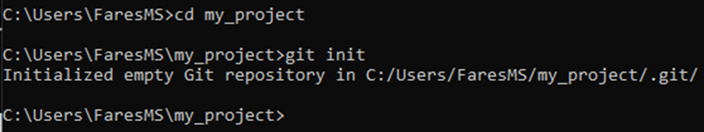

Step 1.2: Create a README.md file
	echo '# My Project' > README.md
	This command creates a README.md file with a brief description of the project.
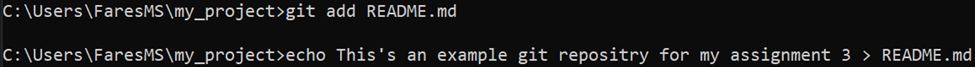
Step 1.3: Stage and commit the README.md file
	git add README.md
	git commit -m "Initial commit with README.md"
	These commands stage the README.md file and commit it to the repository.
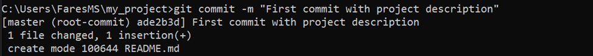
2. Making Changes and Version Control
Step 2.1: Create a new branch named feature-1
	git checkout -b feature-1
	This command creates a new branch named feature-1 and switches to it.
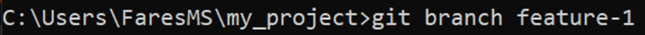
Step 2.2: Add a new file named app.py
	echo 'print("Hello, World!")' > app.py
	This command creates a new Python file app.py with a simple script.
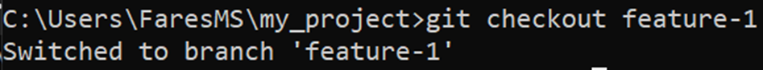

Step 2.3: Stage and commit the app.py file
	git add app.py
	git commit -m "Add app.py with Hello, World! script"
	These commands stage the app.py file and commit it to the feature-1 branch.
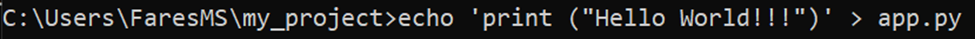
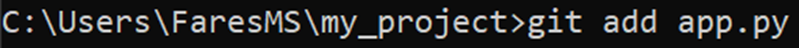

Step 2.4: Modify app.py to include a new function
	Add a new function print_name().
	git add app.py
	git commit -m "Add print_name function to app.py"
	These commands modify the app.py file to include a new function and commit the changes.
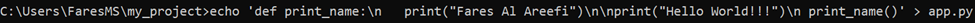
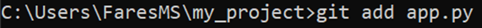
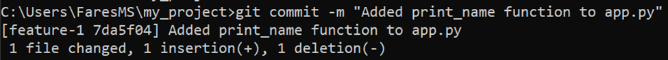

3. Merging Branches

Step 3.1: Switch back to the main branch
	git checkout main
	This command switches back to the main branch.
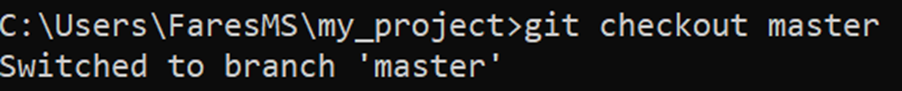

Step 3.2: Merge the feature-1 branch into the main branch
	git merge feature-1
	This command merges the changes from feature-1 into the main branch.
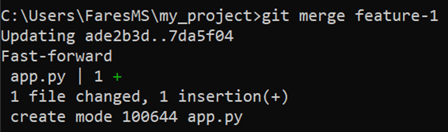

4. Using GitHub
Step 4.1: Create a new repository on GitHub
	Create a new repository named my_project on GitHub.
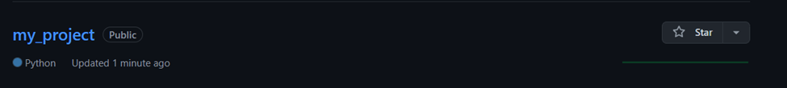

Step 4.2: Push the local repository to GitHub
	git remote add origin https://github.com/DevEnchantments/my_project.git
	git push -u origin main
	These commands add the remote repository and push the main branch to GitHub.
Step 4.3: Ensure that both main and feature-1 branches are available on the remote repository 
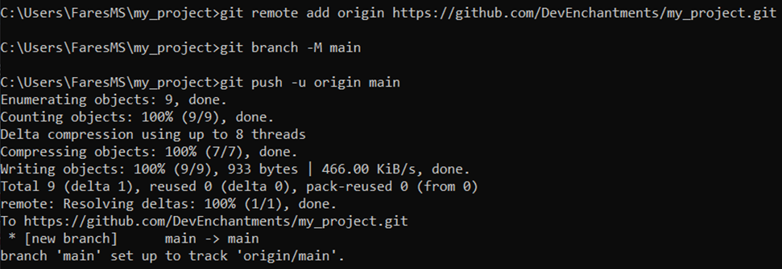
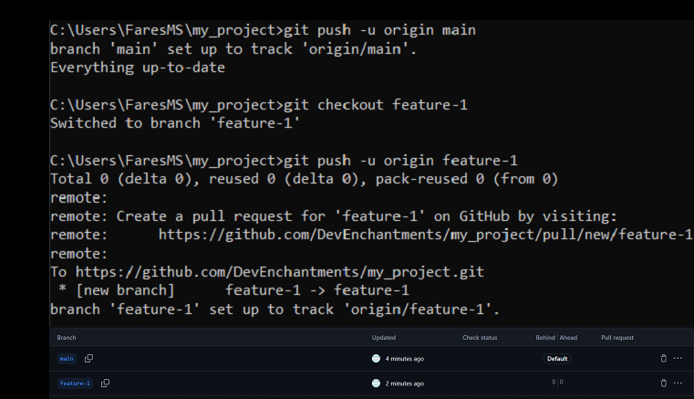

5. Collaboration Simulation
Step 5.1: Create another branch named bugfix-1
	git checkout -b bugfix-1
	This command creates a new branch named bugfix-1 and switches to it.
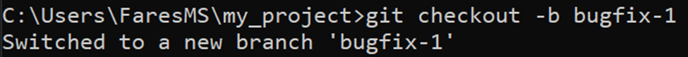

Step 5.2: Simulate a bug fix in app.py
	Correct a typo in the print_name function.
	git add app.py
	git commit -m "Fix typo in print_name function"
	These commands modify the app.py file to fix a typo and commit the changes.
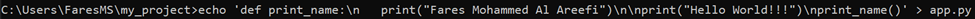

step 5.3: Stage and commit the changes on the bugfix-1 branch.
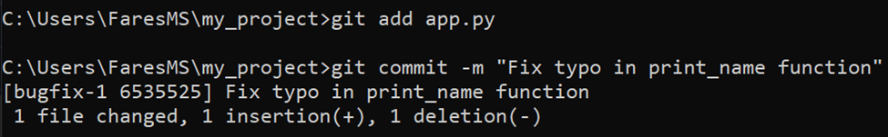

Step 5.4: Push the bugfix-1 branch to the remote repository
	git push origin bugfix-1
	This command pushes the bugfix-1 branch to the remote repository.
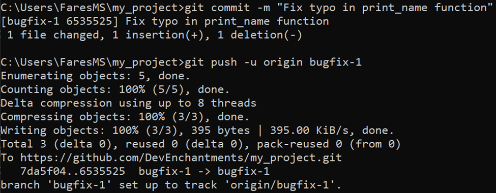

Step 5.5: Open a pull request on GitHub to merge bugfix-1 into main
	Open a pull request on GitHub and merge bugfix-1 into main.
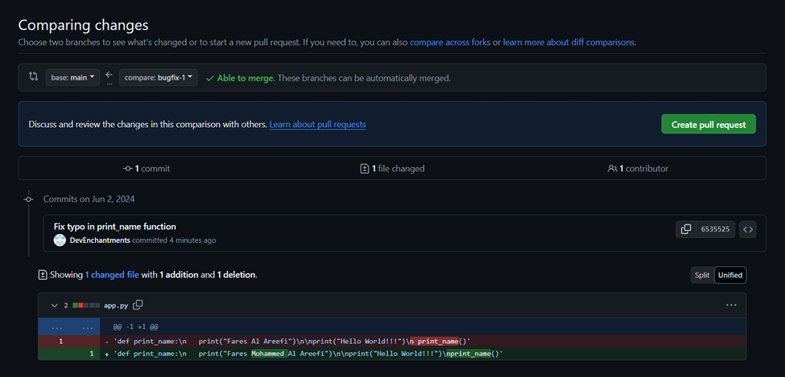
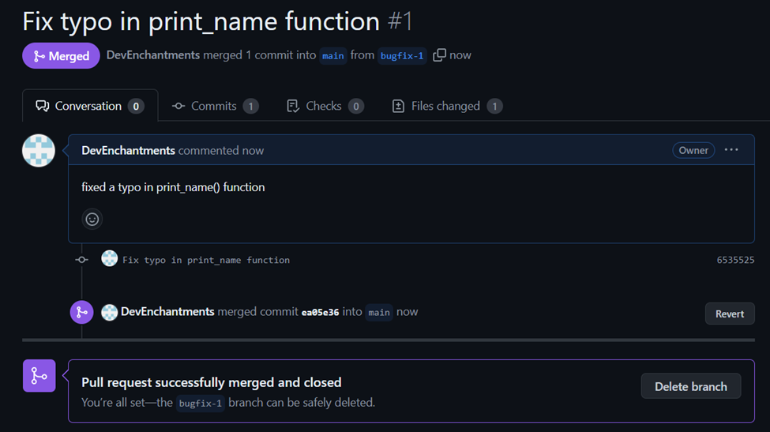

6. History and Reversion
Step 6.1: View the commit history
	git log
	This command displays the commit history.
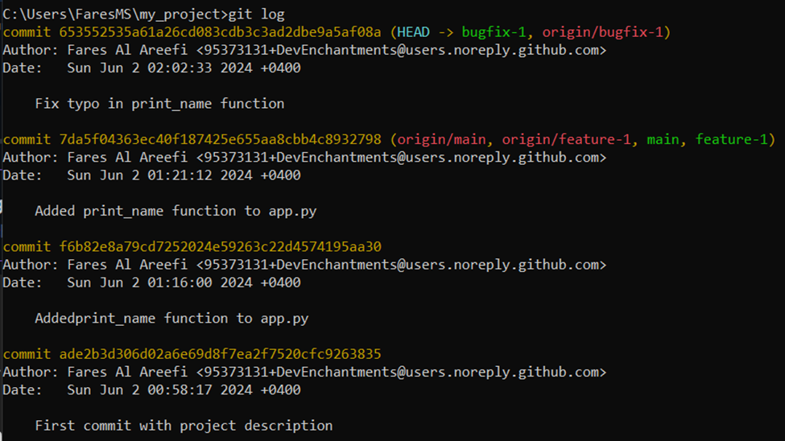

Step 6.2: Revert the last commit
	git revert HEAD
	This command creates a new commit that undoes the changes made by the last commit.
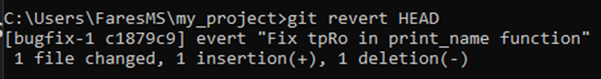
Step 6.3: Undo the revert if necessary
	Identify the revert commit using git log.
	Revert the revert commit using git revert <revert_commit_hash>.
	These commands identify the revert commit and undo it by creating a new commit that reverts the revert.